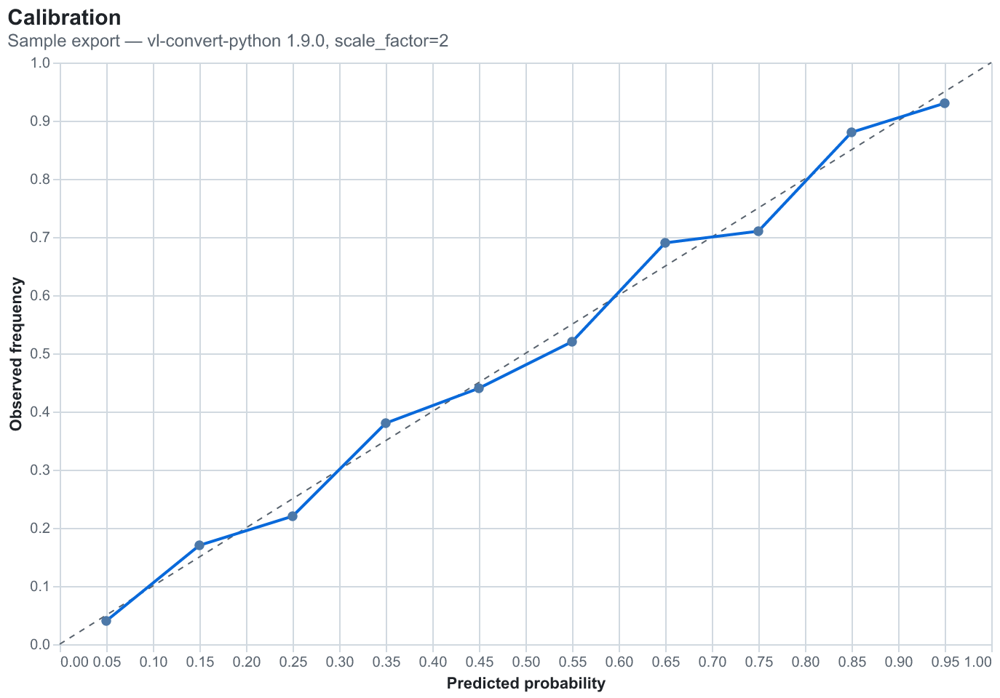

# Altair static export for README embedding

Research for [#4](https://github.com/mattyorkilous/world-cup-predictor/issues/4). Part of [#1](https://github.com/mattyorkilous/world-cup-predictor/issues/1).

**Date:** 2026-09-20 · **Status:** answered, ready to act on.

Legend: **[V]** = verified firsthand on this machine (macOS, uv 0.10.9, CPython 3.12.6,
`altair==6.3.0`, `vl-convert-python==1.9.0.post1`). **[R]** = read from a primary source, not run.

---

## TL;DR

`vl-convert-python` is a single self-contained wheel: no node, no browser, no system fonts
needed. Pin `vl-convert-python==1.9.*` (2.0 is still RC). Export **PNG at `scale_factor=2`**,
two variants per chart (light + dark), and embed with `<picture>` — GitHub officially supports
it, so the "neutral palette" compromise is **not** forced. Regeneration is a plain script run
by hand or in CI; skip the pre-commit hook. The only chart with a real gotcha is the
log-loss-over-time line, which trips Altair's 5000-row limit — fix it by aggregating in polars,
not by disabling the limit.

---

## 1. State of `vl-convert` in 2026

### It needs no non-Python runtime — confirmed by running it with an empty environment

The old `altair_saver` path is dead. Altair's own docs say so outright:

> "`altair_saver` was used in Altair 4 and earlier versions. It is no longer maintained and got
> superseded by `vl-convert` which provides a superior user experience and performance."
> — [Altair, *Saving Charts*](https://altair-viz.github.io/user_guide/saving_charts.html) **[R]**

`vl-convert` embeds the Vega/Vega-Lite JS libraries in a V8 runtime compiled into the Rust
binary, and rasterises through `resvg`
([vega/vl-convert README](https://github.com/vega/vl-convert)) **[R]**.

**[V]** I proved the no-node claim rather than taking it: this machine *has* node on `PATH`, so I
re-ran the export under `env -i PATH=/usr/bin:/bin`, which hides it.

```
PATH = /usr/bin:/bin
node: None | deno: None | npm: None
[calibration] spec=1.2KB png=388.8KB/0.73s svg=13.8KB/0.10s
[shap]        spec=1.0KB png=203.9KB/0.13s svg=10.9KB/0.07s
[heatmap]     spec=19.4KB png=568.6KB/0.28s svg=88.6KB/0.12s
```

It also has **zero Python dependencies** — `importlib.metadata.requires("vl-convert-python")`
returns `None` **[V]**.

### Install weight

**[V]** Measured in a clean venv:

| Package | On-disk |
|---|---|
| `vl_convert` (one `vl_convert.abi3.so`) | **73 MB** |
| `altair` | 5.7 MB |
| `narwhals` (altair's only real runtime dep) | 2.2 MB |

73 MB is the whole cost, and it is one file. Install from a warm uv cache took **2.1 s** **[V]**.
Wheels ship for Windows x86-64, Linux glibc 2.17+ (x86-64, ARM64), macOS 10.12+ x86-64 and
macOS 11+ ARM64, all `abi3` CPython 3.7+
([PyPI](https://pypi.org/project/vl-convert-python/)) **[R]** — so CI needs no compiler.

### Fonts: safe on a bare CI runner

This is the one place a headless Linux box could bite, and it does not, for our default:

- **[V]** Altair's exported SVG uses `font-family="sans-serif"` — the only value in the output.
- **[V]** `strings` on the binary shows **Liberation Sans** (regular/bold/italic/bold-italic)
  compiled in.
- **[R]** [`thirdparty_font.md`](https://github.com/vega/vl-convert/blob/main/thirdparty_font.md)
  confirms Liberation Sans is bundled under the SIL OFL, and appears to be the *only* bundled font.

So the default `sans-serif` stack resolves to a bundled font and renders identically on a runner
with no fonts installed. **If we ever set a named font in a theme** (`"font": "Inter"`), that font
must be installed on the machine, or registered via `vl_convert.register_font_directory()` **[V]**
(the function exists in the module API). Recommendation: stay on `sans-serif`.

### Version to pin

**[V]** Installed stable is `1.9.0.post1`. **[R]** PyPI shows `1.9.0.post1` (2026-01-21) as latest
stable and `2.0.0rc7` (2026-09-14) as the latest pre-release — 2.0 has been in RC for months and
[vega/vl-convert#308](https://github.com/vega/vl-convert/issues/308) reports a behaviour
regression in rc7 (missing relative resources now fail conversion instead of rendering empty).

> **Pin `vl-convert-python>=1.9,<2`.** Revisit when 2.0 goes final.

**[V]** Bundled engines in 1.9.0: Vega-Lite `5.8 … 6.4`, Vega `6.2.0`. Altair 6.3 emits the
`v6.json` schema, which is covered.

### Output quality

**[V]** SVG is real vector output — `<svg ... class="marks" viewBox="0 0 687 447">` with live text
nodes, not outlined paths. PNG is rendered from that SVG by `resvg`; the sample below is visually
clean at 2x with correctly antialiased text and marks.

**[V]** PNG output is **byte-deterministic** — two runs of the same spec produced identical
269,161-byte files. That matters here: regenerated images won't churn git history unless the data
actually changed.

---

## 2. Resolution, format, and the dark-mode question

### GitHub *does* support `<picture>` — a neutral palette is not forced

The premise in the ticket is half right. `prefers-color-scheme` cannot work *inside* a PNG (there
is no CSS in a raster image). But the media query does not have to live inside the image — it
lives in the Markdown, and GitHub supports it:

> "The `<picture>` HTML element is supported."
> — [GitHub Docs, *Basic writing and formatting syntax*](https://docs.github.com/en/get-started/writing-on-github/getting-started-with-writing-and-formatting-on-github/basic-writing-and-formatting-syntax) **[R]**

GitHub's own blog gives the exact snippet **[R]**:

```html
<picture>
  <source media="(prefers-color-scheme: dark)"  srcset="docs/assets/calibration-dark.png">
  <source media="(prefers-color-scheme: light)" srcset="docs/assets/calibration-light.png">
  
</picture>
```

— [*How to make your images in Markdown on GitHub adjust for dark mode and light mode*](https://github.blog/developer-skills/github/how-to-make-your-images-in-markdown-on-github-adjust-for-dark-mode-and-light-mode/)

There is also a GitHub-proprietary shorthand, `` **[R]**
([community discussion #16910](https://github.com/orgs/community/discussions/16910)), which GitHub
desugars into a `<picture>` anyway. **Prefer `<picture>`**: it is standard HTML, so it also works
if the README is ever rendered on PyPI, GitLab, or a static site; the fragment trick only works on
github.com.

Cost: two images per chart instead of one. Given the export is a script, that is one extra loop
iteration.

### Why the default export is wrong for dark mode — and why transparency is a trap

**[V]** Measured corner and centre pixels of the rendered PNG:

| Spec | Corner pixel | Verdict |
|---|---|---|
| Altair default (no `background` key) | `(255,255,255,255)` | **opaque white** — a glaring white slab in GitHub dark mode |
| `background: "white"` | `(255,255,255,255)` | same |
| `background: null` | `(0,0,0,0)` | fully transparent |
| `background: "transparent"` | `(0,0,0,0)` | fully transparent |

Note the default is **opaque white**, not transparent — so doing nothing gives the bad outcome.

The tempting fix is transparency, and it is a trap: with a transparent background the dark axis
labels, titles and gridlines sit directly on GitHub's `#0d1117` and become unreadable. Worse,
**[V]** the antialiased mark pixels come back partially transparent (centre pixel alpha `239`),
so marks composite against whatever is behind them. Two opaque themed exports is the correct fix.

### `scale` and `ppi` multiply each other — a real footgun

**[V]** For a chart declared `width=640, height=400` (687×447 px at 1x including padding):

| Args to `vegalite_to_png` | Output px | Size |
|---|---|---|
| `scale=1` | 687 × 447 | 118 KB |
| `scale=2` | 1374 × 894 | 265 KB |
| `scale=3` | 2061 × 1341 | 441 KB |
| `ppi=144` | 1374 × 894 | 265 KB |
| `ppi=288` | 2748 × 1788 | 598 KB |
| **`scale=2` + `ppi=144`** | **2748 × 1788** | **598 KB** |

`ppi=144` is exactly equivalent to `scale=2`, and passing **both compounds to 4x**. My first probe
run did this by accident and silently produced 4x images. Set **one** of them. Via the Altair API,
`chart.save(..., scale_factor=2)` is the clean spelling **[V]**
([Altair docs](https://altair-viz.github.io/user_guide/saving_charts.html) **[R]**).

### Recommended settings

GitHub's rendered-content container is 980 px wide with 45 px padding, i.e. **~890 px of usable
content width** ([github-markdown-css](https://github.com/sindresorhus/github-markdown-css)) **[R]**.

> **PNG, `scale_factor=2`, logical chart width 640–720 px** → a 1300–1450 px file that fills the
> column and stays crisp on retina. Roughly 250–350 KB per chart **[V]**.

**PNG over SVG**, despite SVG being 10–20x smaller (**[V]** 14 KB vs 389 KB for the calibration
chart). Reasons:

- GitHub **sanitises SVG**, and it demonstrably breaks text layout: the sanitizer strips text-node
  attributes such as `dominant-baseline`, which are exactly what Vega uses to align axis labels
  ([github/markup#1160](https://github.com/github/markup/issues/1160)) **[R]**. Camo also blocks
  external stylesheets and web-font imports **[R]**, so text in an embedded SVG falls back to
  whatever the *viewer's* machine has — not the bundled Liberation Sans we rendered against. PNG
  removes the whole class of problem: the pixels we generate are the pixels shown.
- File size is irrelevant at our scale: ~8 charts × ~300 KB ≈ 2.4 MB in a repo that already ships
  a 147 KB lockfile and parquet caches.

Keep the SVGs too if wanted (they cost ~15 KB each and are nice for a future site), but embed the
PNG.

### Proof

Both files were produced by [`assets/make_samples.py`](assets/make_samples.py) at the
recommended settings (**[V]** 1374 × 960 px; light corner `(255,255,255,255)`, dark corner
`(13,17,23,255)`), and this block is itself the `<picture>` snippet — it will switch theme when
viewed on GitHub:

<picture>
  <source media="(prefers-color-scheme: dark)"  srcset="assets/calibration-dark.png">
  <source media="(prefers-color-scheme: light)" srcset="assets/calibration-light.png">
  
</picture>

---

## 3. Keeping the spec as source of truth

Altair 6's theme registry does exactly what we need: **one chart definition, two exports**, with
the palette swapped by an enabled theme rather than duplicated in the chart code.

**[V]** All of the following ran:

```python
alt.theme.register("gh-dark", enable=False)(lambda: {"config": {...}})
with alt.theme.enable("gh-dark"):          # scoped; reverts on exit
    chart.save("docs/assets/calibration-dark.png", scale_factor=2)
```

**[V]** `alt.theme.active` returns to `"default"` after the context exits, so themes don't leak
between charts in one script run. Altair 6 also ships 17 built-in themes including `dark`
(`alt.theme.names()`) **[V]** — but GitHub's `dark` is `#0d1117`, and Altair's built-in `dark` is
`#333` **[V]**, so a small custom theme pair is worth the ~20 lines.

**[V]** `chart.save("x.png")` finds vl-convert automatically — no `engine=` argument needed, no
explicit `vl_convert` import in the chart code. The dependency stays a pyproject entry.

### Where to run it

> **Recommendation: a `charts.py` module exposing the specs, plus one script that writes the PNGs,
> run by hand and verified in CI.**

Ranked, with the reasoning:

1. **Plain script, run manually, images committed.** The predictions only change when a model run
   happens, which is already a deliberate act. Since PNG output is byte-deterministic **[V]**, a
   no-op regeneration produces no diff, so there is nothing to police most of the time.
2. **CI check, not CI commit.** A workflow step that regenerates into a temp dir and
   `git diff --exit-code`s against the committed files catches a stale README. This is worth
   adding once charts exist. Bot-committing generated images back to `main` is the pattern that
   produces merge conflicts and infinite loops; avoid it.
3. **Pre-commit hook — skip it.** A hook that shells out to a 73 MB renderer on every commit
   taxes every commit to catch a problem that arises a few times a year, and hooks that rewrite
   files under you are the ones people `--no-verify` past. YAGNI.

The images must be committed either way: GitHub renders the README from the repo, so the PNGs
have to be in it. `.gitignore` currently ignores nothing relevant **[V]**.

---

## 4. Per-chart gotchas

### Log-loss over time — this is the 5000-row one

**[V]** Confirmed with a realistic 8000-row walk-forward series:

```
[logloss] to_dict FAILED: MaxRowsError: The number of rows in your dataset (8000)
is greater than the maximum allowed (5000).
```

Two things worth knowing:

- The error fires in **`chart.to_dict()`** — *before* vl-convert is ever called **[V]**. It is an
  Altair guard, not a renderer limit, and it still exists in Altair 6.3.
- The guard exists because Altair inlines the data into the spec as JSON. It is protecting you
  from a real problem, not being pedantic.

**[V]** Measured the three ways out:

| Approach | Spec | PNG | Render |
|---|---|---|---|
| `alt.data_transformers.disable_max_rows()` | **672 KB** | 774 KB | 1.59 s |
| Aggregate to monthly in polars first (526 rows) | **45 KB** | 533 KB | **0.17 s** |
| `enable("vegafusion")` | — | — | needs an extra dependency |

Pre-aggregation is one of the four fixes Altair's own docs list (alongside VegaFusion,
`disable_max_rows()`, and passing data by URL) **[R]**.

> **Aggregate in polars before charting.** 15x smaller spec, 9x faster render, and it matches the
> map's standing "polars-native" preference — the rollup is a `group_by(...).agg(...)`, done at
> the data layer where it belongs. A 640 px-wide chart has ~640 addressable columns; plotting
> 8000 daily points into it is drawing detail no one can see.

`disable_max_rows()` is the wrong reflex here — it inlines every row into JSON that then gets
committed as a spec and re-parsed on every render. Don't reach for `vegafusion` either: it is an
extra dependency to defeat a guard that a `group_by` satisfies for free.

### Advancement-probability heatmap — sizing, not row count

**[V]** 48 teams × 7 stages = **336 rows**. Nowhere near the limit; the row cap is a non-issue.

The real constraint is vertical: 48 team labels need ~18–20 px each, so the chart is ~900–1000 px
tall against a ~640 px width. **[V]** Rendered fine (569 KB PNG at 2x, 0.28 s) but it is a tall
portrait image — in a README it will render column-width and the text will shrink. Options: split
into three 16-team panels (`alt.hconcat`), or drop to the ~20 teams with non-trivial advancement
probability and bucket the rest. Also: **[V]** the heatmap's spec is 19 KB vs ~1 KB for the other
charts, because every cell is a JSON object — still trivial, just noting it scales with cells.

Colour: a sequential scheme that reads in both themes. Avoid `viridis`-style ramps whose dark end
vanishes on `#0d1117`; the `lighter → brand` direction survives both backgrounds.

### Calibration curve — layering, not export

**[V]** Exports cleanly (389 KB, 0.73 s — the 0.73 s includes one-time V8 warmup; subsequent
charts rendered in 0.13–0.28 s).

Two notes:

- The y=x reference line is a **second layer over a different dataframe** (`diagonal + curve`),
  and the layer inherits nothing — set `scale=alt.Scale(domain=[0,1])` on *both* axes explicitly
  or the diagonal will rescale the plot **[V]** (done in the sample script).
- **[R/design]** Force a square aspect ratio (`width == height`) — a calibration plot read on a
  non-square canvas misleads about how far the curve sits from the diagonal. The sample uses
  640×400 to demo README fit; the real one should be square.

### SHAP feature importance — no export problem, one Altair idiom

**[V]** Smallest and fastest of the four (204 KB, 0.13 s). 12 features, no row-limit concern.

The one thing to get right is sorting — bar charts sort alphabetically by default. Use
`alt.Y("feature:N", sort="-x")` **[V]** (verified in the probe), not a pre-sorted dataframe:
Altair will re-sort the axis regardless of row order, so pre-sorting in polars looks like it works
and then silently doesn't.

Note the `shap` package is **not** yet a dependency of this project **[V]** (`pyproject.toml` has
ipykernel, kagglehub, numpy, polars-lts-cpu, scikit-learn). Computing the values is a separate
question from plotting them; this note only covers the plot. Feed Altair a tidy two-column
polars frame of `feature` / `mean_abs_shap` and never touch `shap.plots` — that would drag in
matplotlib and produce a chart that doesn't match the others.

---

## Open questions (not blockers)

- Whether to commit the SVGs alongside the PNGs for a possible future site. Cheap (~15 KB each);
  defer until there is a site.
- Exact palette. Should be settled once, as a themes module, so all charts match — that is a
  design decision, not a research one.

## Sources

**Primary**
- [vega/vl-convert](https://github.com/vega/vl-convert) — runtime model, formats
- [vl-convert `thirdparty_font.md`](https://github.com/vega/vl-convert/blob/main/thirdparty_font.md) — bundled Liberation Sans
- [vl-convert-python on PyPI](https://pypi.org/project/vl-convert-python/) — versions, wheels, platforms
- [vega/vl-convert#308](https://github.com/vega/vl-convert/issues/308) — 2.0.0rc7 regression
- [Altair, *Saving Charts*](https://altair-viz.github.io/user_guide/saving_charts.html) — `altair_saver` superseded; `scale_factor` / `ppi`
- [Altair, *Large Datasets*](https://altair-viz.github.io/user_guide/large_datasets.html) — the 5000-row guard
- [GitHub Docs, *Basic writing and formatting syntax*](https://docs.github.com/en/get-started/writing-on-github/getting-started-with-writing-and-formatting-on-github/basic-writing-and-formatting-syntax) — `<picture>` is supported
- [GitHub Blog, dark/light images in Markdown](https://github.blog/developer-skills/github/how-to-make-your-images-in-markdown-on-github-adjust-for-dark-mode-and-light-mode/) — official snippet

- [github/markup#1160](https://github.com/github/markup/issues/1160) — GitHub's SVG sanitizer strips text-alignment attributes

**Secondary**
- [community discussion #16910](https://github.com/orgs/community/discussions/16910) — `#gh-dark-mode-only` fragments
- [github-markdown-css](https://github.com/sindresorhus/github-markdown-css) — 980 px container width
